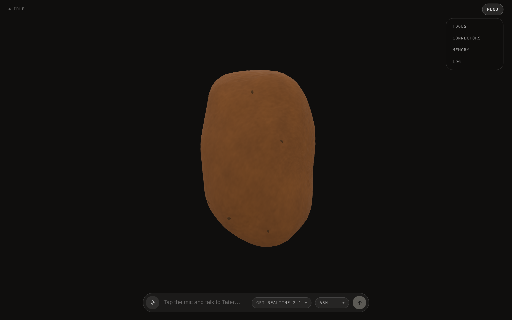
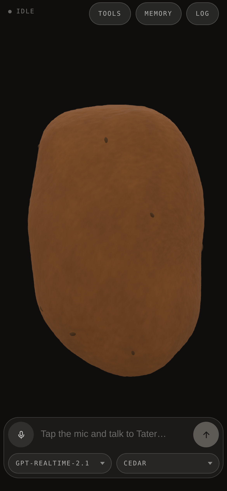
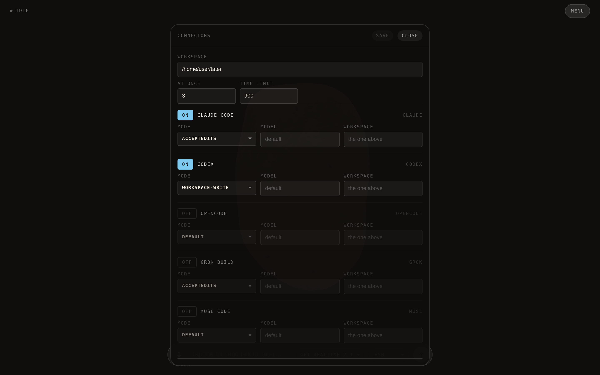

# Tater

A voice agent rendered as a potato. Tater is russet and lumpy, and rude about
it: he stands on his end and rocks where he is, walks a
short way out and back while he talks, lies down and spins while he thinks, and
squashes in time with whoever is making sound — all of it driven by a live
OpenAI Realtime call. He remembers what you tell him to, between calls, and
hands work off to a coding agent.



<p align="center">
  
</p>

## Run

```sh
git clone https://github.com/h1ddenpr0cess20/tater
cd tater
npm install
cp .env.example .env      # add your OPENAI_API_KEY
npm run dev               # → http://localhost:5173
```

Click the mic, allow the browser's microphone prompt, and start talking.

Tapping the mic is the microphone switch: turning it off stops what you send and
leaves the answer playing, and the conversation is still there when you turn it
back on. It also switches itself off after a minute of silence, and the call
survives that too. Holding the mic down is the hang-up — a ring closes around it
while you hold, and the call ends when it lands.

`tools` is where the per-call switches will be. It is empty today — memory has
its own switch, and the connectors answer for the whole server rather than for
one browser — but the panel and the storage behind it are wired, so a tool the
session learns to declare shows up there with a switch of its own.

`connectors` is where you hand Tater a coding agent. Switch on Claude Code,
Codex, OpenCode, Grok Build or Muse Code, point it at a repo, and say what you
want built: Tater reads the task back, dispatches it on a yes, and tells you
when it lands.
The agent runs headless on the machine serving the page and edits real files, so
nothing is on until you turn it on — see
[configuration](docs/configuration.md#connectors).



Which agent is on, where it works, and how much it is allowed to do are all in
the panel, and take effect without a restart. What each one runs is not:
choosing the binary this server executes stays in the environment.

The log keeps every conversation. `continue` on one picks it back up: the call is
dialled again with those turns handed over as context, and what you say from
there lands in the same entry rather than a new one.

| Script | |
|---|---|
| `npm run dev` | Vite, with the proxy mounted as middleware — one process |
| `npm run dev:lan` | The same, over HTTPS on the network — for a phone |
| `npm run build` | Bundles the client to `dist/` |
| `npm start` | Serves `dist/` with the same proxy in front |
| `npm run preview` | `build` then `start` |
| `npm run preview:lan` | `build` then `start`, over HTTPS on the network |
| `npm test` | `node:test` over the server |
| `npm run lint` | ESLint |

CI runs the lint, the tests on Node 22.12 and 24, and a build that then has to
boot and serve itself over both HTTP and HTTPS. CodeQL scans the same source on
every push and again weekly, since its queries change faster than this does.

To run it on a phone, or in Docker, see
[configuration](docs/configuration.md#on-a-phone).

## Docs

- [**Configuration**](docs/configuration.md) — every environment variable, the
  voice picker, the HTTPS setup a phone needs for microphone access, and Docker.
- [**Design notes**](docs/design.md) — how the call is wired, what's in
  `localStorage`, the moods, the source layout, and the seam another provider
  would have to implement.
- [**AI Output Disclaimer**](docs/ai-output-disclaimer.md) — what the model says
  is the model's, not the author's, plus the risks that are specific to a live
  microphone and speech you hear before anyone can check it.
- [**Not a Companion**](docs/not-a-companion.md) — Tater is a toy and a demo.
  It is not a friend, a therapist, or a partner, and the project will not grow in
  that direction.
